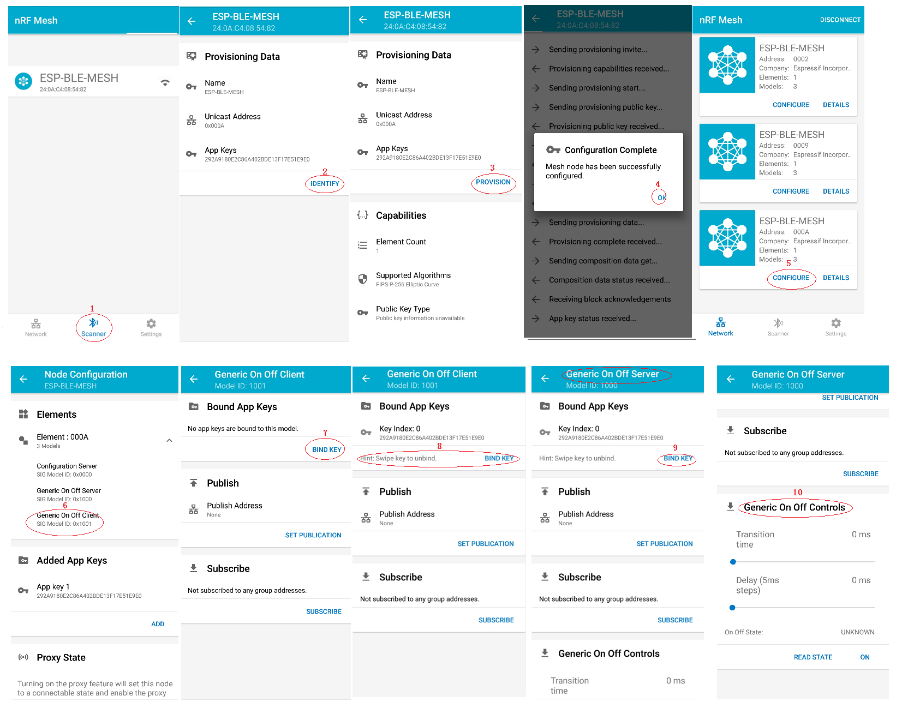

# ESP BLE Mesh client model demo

## requirement

You need two devices to run this project.One device run ble_mesh_client_model project,One device run ble_mesh_node project.
You need to use the nRF Mesh app.

The timing diagram is shown below：


<div align="center"> </div>

**note：The node does not send a message immediately after entering the address through the serial port.
When nRF_Mesh_App sends a control message to the node, the client node sends a message to the node of the previously entered message.**

## Use nRF_Mesh_App



<div align="center"> </div>

> * 如上图标注 1 所示，文件代码模板支持的类型基本常见的文件类型都涵盖了。
> * 如上图标注 2 所示，这是 Java 文件模板新建的代码模板，其中 `${PACKAGE_NAME}、${NAME}` 是 IntelliJ IDEA 预设的变量。
> * 如上图标注 3 所示，IntelliJ IDEA 的文件代码模板是可以使用 `Velocity Template Language` (VTL) 进行书写的。如图 2 上的 `#if ... #end` 和 `#parse` 都是 VTL 的语法。
> * 如上图标注 4 所示，介绍当前文件模板的一些信息，以及一些预设变量的作用介绍。
> * 如上图标注 5 所示，这四个按钮是文件代码模板的主要操作按钮，四个操作分别是：
>
>> * `Create Template` 创建一个文件代码模板。 
>> * `Remove Template` 删除一个文件代码模板，标注 1 所示的这些预设模板是不允许删除的，只能能删除预设之外的新增的。
>> * `Copy Template` 复制一个文件代码模板。 
>> * `Reset To Default` 对被修改的预设文件代码模板，还原到默认状态。
## 1. Introduction

### 1.1 Node Composition
This demo has only one element, in which the following two models are implemented:
- **Configuration Server model**: The role of this model is mainly to configure Provisioner device’s AppKey and set up its relay function, TTL size, subscription, etc.
- **Generic OnOff Client model**: This model implements the most basic function of turning the lights on and off.

### 1.2 Demo Function

1 Input the address of another node as the destination address through the serial port.
2 Generic OnOff client model send messge to Generic OnOff server model.

### 1.3 Server and Client Model Interaction

You can choose the following 4 ways to interact：
1. Acknowledged Get
2. Acknowledged Set
3. Unacknowledged Set
4. Acknowledged set with periodic publishing


## 2. Code Analysis

### 2.1 receive command by uart

You should use the serial port tool.Connect the pins of the device 16,17.

```c
#define UART1_TX_PIN  GPIO_NUM_16
#define UART1_RX_PIN  GPIO_NUM_17
```
There is a Task here that receive command by uart.
You can enter the address of another node as the destination address for the message.

```c
static void board_uart_task(void *p)
{   
    uint8_t *data = calloc(1, UART_BUF_SIZE);
    uint32_t input;
    
    while (1) { 
        int len = uart_read_bytes(MESH_UART_NUM, data, UART_BUF_SIZE, 100 / portTICK_RATE_MS);
        if (len > 0) {
            input = strtoul((const char *)data, NULL, 16);
            remote_addr = input & 0xFFFF;
            ESP_LOGI(TAG, "%s: input 0x%08x, remote_addr 0x%04x", __func__, input, remote_addr);
            memset(data, 0, UART_BUF_SIZE);
        }
    }
    
    vTaskDelete(NULL);
}
```
### 2.2  model init

#### 2.2.1 onoff server model init
```c
//model publish init,Allocating space to publish message.
static esp_ble_mesh_model_pub_t onoff_srv_pub = {
    .msg = NET_BUF_SIMPLE(2 + 1),
    .update = NULL,
    .dev_role = MSG_ROLE,
};
//registe massage opcode
static esp_ble_mesh_model_op_t onoff_op[] = {
    { ESP_BLE_MESH_MODEL_OP_GEN_ONOFF_GET, 0, 0},
    { ESP_BLE_MESH_MODEL_OP_GEN_ONOFF_SET, 2, 0},
    { ESP_BLE_MESH_MODEL_OP_GEN_ONOFF_SET_UNACK, 2, 0},
    ESP_BLE_MESH_MODEL_OP_END,
};
//registe onoff server model.
static esp_ble_mesh_model_t root_models[] = {
    //onoff server's onoff state init
    ESP_BLE_MESH_SIG_MODEL(ESP_BLE_MESH_MODEL_ID_GEN_ONOFF_SRV, onoff_op,
    &onoff_srv_pub, &led_state[0]),
};
```
#### 2.2.2 onoff client model init
```c
//model publish init,Allocating space to publish message.
static esp_ble_mesh_model_pub_t onoff_cli_pub = {
    .msg = NET_BUF_SIMPLE(2 + 1),
    .update = NULL,
    .dev_role = MSG_ROLE,
};
//registe onoff client model.
static esp_ble_mesh_model_t root_models[] = {
    ESP_BLE_MESH_MODEL_GEN_ONOFF_CLI(&onoff_cli_pub, &onoff_client),
};
```


### 2.3 model callback
#### 2.3.1 onoff client model callback
```c
esp_ble_mesh_register_generic_client_callback(esp_ble_mesh_generic_cb);

```
1. Callback trigger.
>Receiving a message about onoff client mode will trigger this callback function
>call send messgae API about onoff client model.

2. The event that the callback function needs to handle.

| Event name | Description                    |
| ------------- | ------------------------------ |
| ESP_BLE_MESH_GENERIC_CLIENT_GET_STATE_EVT    |onoff client model receive messages from onoff server model       |
| ESP_BLE_MESH_MODEL_OP_GEN_ONOFF_GET   | receive ackownleged before send `ESP_BLE_MESH_MODEL_OP_GEN_ONOFF_GET` message   |
| ESP_BLE_MESH_GENERIC_CLIENT_SET_STATE_EVT   | onoff client model receive messages from onoff server model      |
| ESP_BLE_MESH_MODEL_OP_GEN_ONOFF_SET   |  receive ackownleged before send `ESP_BLE_MESH_MODEL_OP_GEN_ONOFF_SET` message     |
| ESP_BLE_MESH_GENERIC_CLIENT_PUBLISH_EVT   | receive publish message    |
| ESP_BLE_MESH_GENERIC_CLIENT_TIMEOUT_EVT   | send message timeout event    |
| ESP_BLE_MESH_MODEL_OP_GEN_ONOFF_SET   | send  `ESP_BLE_MESH_MODEL_OP_GEN_ONOFF_SET` message timeout event  |


#### 2.3.2 onoff server callback
```c
esp_ble_mesh_register_custom_model_callback(esp_ble_mesh_model_cb);

```
1. Callback trigger.
>Receiving a message about onoff server mode will trigger this callback function
>call send messgae API about onoff server model.
2. The event that the callback function needs to handle.

| Event name | Description                    |
| ------------- | ------------------------------ |
| ESP_BLE_MESH_MODEL_OPERATION_EVT    | onoff server model receive messages from onoff client model.         |
| ESP_BLE_MESH_MODEL_OP_GEN_ONOFF_GET    | Registered before （static `esp_ble_mesh_model_op_t` onoff_op[]）   |
| ESP_BLE_MESH_MODEL_OP_GEN_ONOFF_SET    | Registered before （static `esp_ble_mesh_model_op_t` onoff_op[]`）   |
| ESP_BLE_MESH_MODEL_OP_GEN_ONOFF_SET_UNACK  |Registered before （static `esp_ble_mesh_model_op_t` onoff_op[]`）|
| ESP_BLE_MESH_MODEL_SEND_COMP_EVT    | Call `esp_ble_mesh_server_model_send_msg` API will trigger this event when it call completion |
| ESP_BLE_MESH_MODEL_PUBLISH_COMP_EVT    | Call `esp_ble_mesh_model_publish` API will trigger this event when it call completion     |

### 2.4 model send messgae
#### 2.4.1 onoff client send messgae
esp_ble_mesh_generic_client_get_state
```c
esp_ble_mesh_generic_client_get_state_t get_state = {0};
esp_ble_mesh_set_msg_common(&common, node, onoff_client.model, ESP_BLE_MESH_MODEL_OP_GEN_ONOFF_GET);
err = esp_ble_mesh_generic_client_get_state(&common, &get_state);
if (err) {
    ESP_LOGE(TAG, "%s: Generic OnOff Get failed", __func__);
    return;
}
```
esp_ble_mesh_generic_client_set_state
```c
esp_ble_mesh_generic_client_set_state_t set_state = {0};
esp_ble_mesh_set_msg_common(&common, &set_state, onoff_client.model,
                             ESP_BLE_MESH_MODEL_OP_GEN_ONOFF_SET, remote_onoff);
err = esp_ble_mesh_generic_client_set_state(&common, &set_state);
if (err != ESP_OK) {
    ESP_LOGE(TAG, "%s: Generic OnOff Set failed", __func__);
    return;
}
```

#### 2.4.2 onoff server send messgae
esp_ble_mesh_server_model_send_msg
```c
err = esp_ble_mesh_server_model_send_msg(model, ctx, ESP_BLE_MESH_MODEL_OP_GEN_ONOFF_STATUS,
       sizeof(send_data), &send_data);
```
esp_ble_mesh_model_publish
```c
err = esp_ble_mesh_model_publish(model, ESP_BLE_MESH_MODEL_OP_GEN_ONOFF_STATUS,
                                 sizeof(led->current), &led->current, ROLE_NODE);
```

