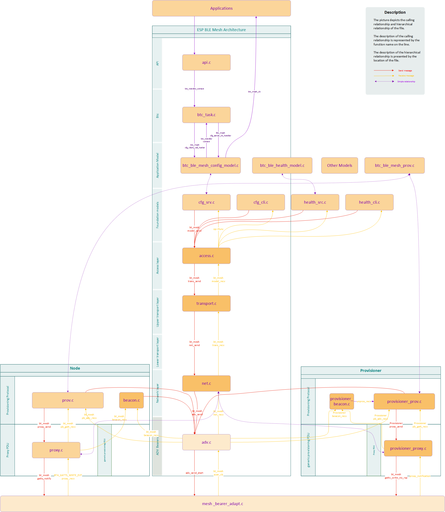

# ESP BLE MESH 框架
本文主要介绍 ESP BLE MESH 协议栈的 4 个方面： 协议栈的基本组成，协议栈框架图，协议栈详细接口图，代码目录树。

## 协议栈基本组成
* Mesh Networking
蓝牙mesh网络引入了全新的协议栈,这一协议栈建立在低功耗蓝牙技术之上，该协议栈分为7层，其每层的定义如下表所示：

| Layer      | Function |
| --------- | -----|
| 承载层（bearer layer）  | 承载层定义了如何使用底层低功耗堆栈传输PDU。目前定义了两个承载层：广播承载层（Advertising Bearer）和GATT承载层。 |
| 网络层（network layer） | 网络层定义了各种消息地址类型和网络消息格式。中继和代理行为通过网络层实施。 |
| 底层传输层（lower transport layer）| 在需要之时，底层传输层能够处理PDU的分段和重组。 |
| 上层传输层（upper transport layer）| 负责对接入层进出的应用数据进行加密、解密和认证。它还负责称为“传输控制消息”（transport control messages）这一特殊的消息，包括与“friendship”相关的心跳和消息。 |
| 接入层（access layer）     | 负责应用数据的格式、定义并控制上层传输层中执行的加密和解密过程，并在将数据转发到协议栈之前，验证接收到的数据是否适用于正确的网络和应用。|
| 基础模型（foundation models）| 基础模型层负责实现与mesh网络配置和管理相关的模型。|
| 模型（models）    | 模型层与模型等的实施、以及诸如行为、消息、状态等的实施有关。|

* Provisioning(配置协议): （问一下）
配置协议是用来将未配置设备加入到mesh网络中的，该协议分为3层，每层的功能如下表所示：

| Layer     | Function |
| --------- | -------  |
| 承载层（bearer layer）  | 配置协议接收数据包有两个通道，PB-GATT 和 PB-ADV |
| 传输层（Transport layer） | 处理proxy PDU 和 Generic Provisioning PDU |
| 配置协议（ Provisioning Protocol）| 对设备进行配置 |

* 应用层:
应用层和协议栈之间通过 btc_task 任务进行隔离，btc_task 维护了一个队列，用于处理应用层 API 的调用请求和协议栈上报事件请求，btc_task任务会不断的从队列里面获取数据进行处理。
应用层调用API：用户任务(user_task)每调一个API会向队列里面发送一个消息，btc_task 任务接收到该消息后会调用协议栈的相关函数；当该 API 处理完成后，会向应用层上报API调用完成事件。
应用层事件：协议栈向应用层上报一个事件时会向队列里面发送一个消息，btc_task任务接收到该消息后会调用应用层先前注册的回调函数。

API 设计方式是基于事件的，每调用一个API都会有对应的事件触发。
用户使用的API主要操作 Model 和 provisioner 相关层提供的函数，并不会跨越协议栈的层进行操作。比如API不会调用到 network layer 相关的函数。

* 辅助程序:
	* feature
		* friend ：实现朋友特性
		* lpn：实现低功耗特性
		* proxy：实现代理特性
		* relay：实现中继特性

	* 网络管理相关程序
		* Mesh Network Creation procedure ：网络创建程序
		* Key Refresh procedure ：秘钥更新程序
		* IV Update procedure ：网络索引更新程序
		* IV Index Recovery procedure：网络索引恢复程序
		* Node Removal procedure：节点移除程序

## 代码结构介绍

## 协议栈框架图 

框架图的设计是将 Mesh Networking 部分和 Provisioning 合并到一起。Mesh Networking 部分负责设备入网后的消息处理，Provisioning 部分负责设备入网前的消息处理。其中 Provisioning 部分的消息首先会经过 adapt layer，adapt layer 是 BLE 和 BLE MESH的适配层。

其中黄色线条表示： API 最终会调用到 Model Layer，Foundation Layer 和 Provisioning protocol 相关的函数。
紫色线条表示：     消息传输时会经过的相关的层的处理关系。从左往右的方式描述：

## 协议栈详细接口图

接口图详细的描述了每一层对应的实现文件和文件的接口函数，也反应了数据包接收和发送的处理流程。
